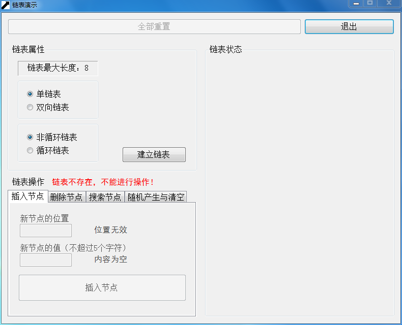
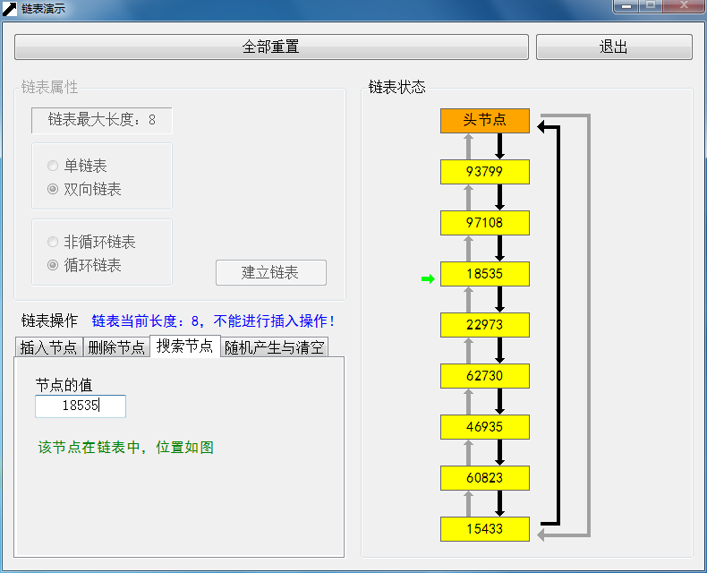

# 链表

### 1. 设计目标

通过图形交互界面，实时显示单链表、循环单链表、双向链表和循环双向链表的建立、插入、删除、查找、随机构造和和清空操作。

### 2. 设计思想

#### 2.1. 自底向上的设计思想

在设计过程中，首先设计最低层的链表结点类`class Node`，然后设计链表管理类`class LinkList<T>`，最后设计用户交互界面`class FormMain`。

#### 2.2. 面向对象的设计思想

C#.net是面向对象的编程语言，有以下主要特性：

- 没有“全局”的概念，以类作为顶层；
- 所有的类都继承自`class Object`。

这意味着，用该语言制作的所有程序都是面向对象的。

### 3. 构成

整个 Visual Studio 解决方案由三个项目构成：

- 项目LinkListCpp：链表数据结构的C++实现。
- 项目LinkListCoreTest：主项目中链表数据结构的测试。
- 项目Linklist：主项目。

### 4. 开发平台

- 使用 Microsoft Visual Studio 2013 Ultimate 开发
- 使用 C#.net 语言开发
- 基于 .net Framework 3.5 平台开发

### 5. 运行截图

### 6. 结果分析

本软件可以清晰地展现单链表、双向链表、非循环链表和循环链表的生成过程和销毁过程，同时还可以方便地进行插入节点、删除节点、搜索节点、随机产生链表和清空链表的操作。尽管在数据结构的实现中，链表可以做得很长，但是受到窗体大小的限制，链表的最大长度（不含头节点）为8。

窗体控件的设计给予用户很大的引导性——例如，按钮的设计使得用户只能进行当前允许的操作。窗体的设计十分人性化——例如，在进行插入节点、删除节点和搜索节点操作时，节点左边实时显示小箭头。同时，窗体的功能分区明确而有序，整体感比较好。

邀请多位同学对本软件进行了使用测试，未发现任何错误或异常。

### 7. 操作说明

双击位于桌面的“链表演示.exe”以运行软件。

首先必须设定明确链表的类型（单链表/双向链表/非循环链表/循环链表）。此时用户需要在位于左上角的“链表属性”分组框中完成这些设置，然后单击“建立链表”以继续。这时，右侧“链表状态”分组框将显示出链表的头节点。

接下来就可以进行对链表的操作了。用户可以在位于左下角的几个选项卡中对链表进行操作。

用户在进行插入/删除/查找操作的时候，输入文本框旁边的标签可以显示输入是否合法。在输入合法的情况下，右侧“链表状态”分组框将显示用于指示插入/删除/查找位置的小箭头。用户不用担心非法输入会被读取，因为只有在没有非法输入情况下，选项卡下方的“插入节点”/“删除节点”按钮才可以被点击（事实上，在整个窗体之中，如果控件可用，那么一定是合法操作）。

用户可以进行随机产生链表/清空链表操作，只需点击对应选项卡中的对应按钮即可。

用户可以点击顶部的“全部重置”按钮回到软件刚开始运行的状态。

单击“退出”按钮，软件将会退出。

### 8. 其他

- 所有".md"文件是用[Typora](http://typora.io)编写的。
- 所有".md"文件的风格是[Github Flavored Markdown](https://guides.github.com/features/mastering-markdown/#GitHub-flavored-markdown)。
- 各行以CRLF（Windows）结尾。
